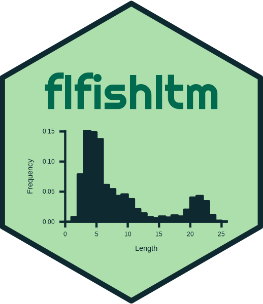
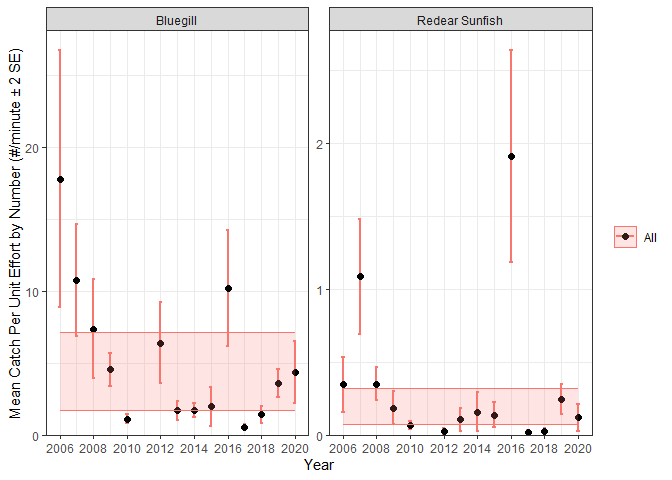

<!-- README.md is generated from README.Rmd. Please edit that file -->

# flfishltm 

<!-- badges: start -->
<!-- badges: end -->

This package provides functions to assist with summarizing, analyzing,
visualizing, and reporting freshwater fish population monitoring data.

## Installation

Add `flffishltm` repository to package repository list.

``` r
options(repos = c(
          flfishltm = "https://jasono6359.r-universe.dev",
          CRAN = "https://cloud.r-project.org"))
```

To add a persistent reference to the repository you can add the above
code to your .Rprofile file. To quickly open and edit .Rprofile use:

``` r
usethis::edit_r_profile(scope = "user")
```

Once the repository has been referenced, `flfishltm` can be installed
using

``` r
install.packages("flfishltm")
```

## Example

Load package

``` r
library(flfishltm)
## basic example code
```

Create data summary tables

``` r
newn_sum <- ltm.data.summary("Newnans", newnans)
#> Joining with `by = join_by(Year, yr, Species)`
#> Joining with `by = join_by(Year, yr, Species)`
#> Joining with `by = join_by(Year, yr, Species)`
#> Joining with `by = join_by(Year, yr, Species)`
#> Joining with `by = join_by(Year, yr, Species)`
#> Joining with `by = join_by(Year, yr, Species)`
#> Joining with `by = join_by(Year, yr, Species)`
#> Joining with `by = join_by(Year, yr, Species)`
#> Joining with `by = join_by(Year, yr, Species)`
```

Access summary tables

``` r
names(newn_sum)
#>  [1] "SpeciesList"     "SpeciesHistory"  "CPUE_Tab_number" "CPUE_number"    
#>  [5] "CPUE_number_SE"  "CPUE_Tab_weight" "CPUE_weight"     "CPUE_weight_SE" 
#>  [9] "Comp_num"        "Comp_wt"         "Year_Sites"      "Comp_Sum"       
#> [13] "TotalCount"      "RawData"         "annual_summary"
head(newn_sum$CPUE_number)
#>           Year   yr Threadfin Shad Golden Shiner    Bowfin Swamp Darter
#> 1  2006 - 2007 2006      0.6666667     0.9066667 0.2266667  0.006666667
#> 2  2007 - 2008 2007      0.1000000     0.9066667 0.2400000  0.020000000
#> 3  2008 - 2009 2008      0.9000000     0.5120000 0.1880000  0.044000000
#> 4  2009 - 2010 2009      1.0160000     0.4240000 0.2520000  0.000000000
#> 5  2010 - 2011 2010      1.5400000     0.2440000 0.1320000  0.008000000
#> 15 2011 - 2012 2011             NA            NA        NA           NA
#>    Brown Bullhead Bluegill Redear Sunfish Black Crappie Warmouth
#> 1       0.9933333 17.82667      0.3466667     0.7133333    0.640
#> 2       0.3266667 10.75333      1.0866667     0.2800000    0.520
#> 3       0.4120000  7.38800      0.3520000     0.4240000    0.236
#> 4       0.4000000  4.58000      0.1880000     0.3840000    0.392
#> 5       0.0760000  1.13200      0.0680000     0.2760000    0.240
#> 15             NA       NA             NA            NA       NA
#>    Brook Silverside Florida Gar Gizzard Shad Eastern Mosquitofish
#> 1       0.333333333   0.7133333    0.4733333             1.106667
#> 2       0.006666667   0.5266667    0.7266667            10.986667
#> 3       0.344000000   0.7720000    0.3560000             3.408000
#> 4       0.540000000   0.8320000    0.2920000             2.732000
#> 5       0.148000000   0.8240000    0.5000000             0.732000
#> 15               NA          NA           NA                   NA
#>    Lake Chubsucker Largemouth Bass Least Killifish Yellow Bullhead
#> 1       0.01333333     0.006666667           0.000      0.00000000
#> 2       0.03333333     0.073333333           0.120      0.01333333
#> 3       0.06000000     0.064000000           0.000      0.00000000
#> 4       0.02400000     0.084000000           0.020      0.00000000
#> 5       0.00800000     0.040000000           0.008      0.00400000
#> 15              NA              NA              NA              NA
#>    Golden Topminnow Sailfin Molly Bluefin Killifish Brown Hoplo Flier
#> 1        0.00000000         0.000             0.000       0.000 0.000
#> 2        0.01333333         0.000             0.000       0.000 0.000
#> 3        0.00000000         0.012             0.000       0.000 0.000
#> 4        0.06800000         0.004             0.020       0.008 0.000
#> 5        0.00800000         0.000             0.004       0.000 0.004
#> 15               NA            NA                NA          NA    NA
#>    Inland Silverside Taillight Shiner Chain Pickerel Flagfish White Catfish
#> 1              0.000            0.000          0.000        0             0
#> 2              0.000            0.000          0.000        0             0
#> 3              0.000            0.000          0.000        0             0
#> 4              0.000            0.000          0.000        0             0
#> 5              0.216            0.004          0.004        0             0
#> 15                NA               NA             NA       NA            NA
#>    sunfish species bluegill-redear hybrid      All
#> 1                0                      0 24.97333
#> 2                0                      0 26.73333
#> 3                0                      0 15.47200
#> 4                0                      0 12.26000
#> 5                0                      0  6.22000
#> 15              NA                     NA       NA
newn_sum$Year_Sites
#> # A tibble: 14 × 2
#>    Sample      `dplyr::n_distinct(Site)`
#>    <chr>                           <int>
#>  1 2006 - 2007                        15
#>  2 2007 - 2008                        15
#>  3 2008 - 2009                        25
#>  4 2009 - 2010                        25
#>  5 2010 - 2011                        25
#>  6 2012 - 2013                        25
#>  7 2013 - 2014                        25
#>  8 2014 - 2015                        25
#>  9 2015 - 2016                        25
#> 10 2016 - 2017                        25
#> 11 2017 - 2018                        25
#> 12 2018 - 2019                        25
#> 13 2019 - 2020                        25
#> 14 2020 - 2021                        25
```

create cpue plot and subset by species and size class

``` r
cpue.plot(newn_sum, speciesList = c("BLUE", "RESU"))
```



    #> # A tibble: 28 × 15
    #> # Groups:   WaterBody, Year, Season, SpeciesCode, SpeciesCommon [28]
    #>    WaterBody   Year Season SpeciesCode SpeciesCommon SpeciesScientific mean_CPUE
    #>    <fct>      <dbl> <chr>  <chr>       <chr>         <fct>                 <dbl>
    #>  1 Newnans L…  2006 Fall   BLUE        Bluegill      Lepomis macrochi…    17.8  
    #>  2 Newnans L…  2006 Fall   RESU        Redear Sunfi… Lepomis microlop…     0.347
    #>  3 Newnans L…  2007 Fall   BLUE        Bluegill      Lepomis macrochi…    10.8  
    #>  4 Newnans L…  2007 Fall   RESU        Redear Sunfi… Lepomis microlop…     1.09 
    #>  5 Newnans L…  2008 Fall   BLUE        Bluegill      Lepomis macrochi…     7.39 
    #>  6 Newnans L…  2008 Fall   RESU        Redear Sunfi… Lepomis microlop…     0.352
    #>  7 Newnans L…  2009 Fall   BLUE        Bluegill      Lepomis macrochi…     4.58 
    #>  8 Newnans L…  2009 Fall   RESU        Redear Sunfi… Lepomis microlop…     0.188
    #>  9 Newnans L…  2010 Fall   BLUE        Bluegill      Lepomis macrochi…     1.13 
    #> 10 Newnans L…  2010 Fall   RESU        Redear Sunfi… Lepomis microlop…     0.068
    #> # ℹ 18 more rows
    #> # ℹ 8 more variables: sd_CPUE <dbl>, se_CPUE <dbl>, max_CPUE <dbl>,
    #> #   min_CPUE <dbl>, cv_CPUE <dbl>, sizeStrata <chr>, lower <dbl>, upper <dbl>

## Additional Help

For help see function help documentation.

``` r
?cpue.plot

# or

help(cpue.plot)
```

Check out the intro vignette for more examples

``` r
RShowDoc("flfishltm_intro", type = "html", package = "flfishltm")
```

Source code available on
[github](https://github.com/jasono6359/flfishltm)
